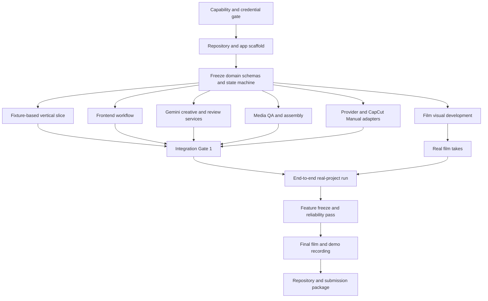

# Implementation Plan — The Director Who Does Not Exist

## 1. Purpose

This plan converts the PRD into a feasible 29-hour hackathon build. It separates:

- work that must happen in a strict order;
- work that can run in parallel after contracts are frozen;
- integration gates where parallel work must rejoin;
- fallback decisions if CapCut, Gemini, or a video provider is unavailable;
- the production of the companion film from the production of the tool.

The primary submission is the tool. The companion film is the proof that the tool can direct, review, repair, and preserve generative accidents.

## 2. Product Language Policy

English is the product's primary and default language.

### Required English surfaces

1. Product name, navigation, buttons, forms, empty states, error messages, tooltips, notifications, and review labels.
2. API field names, state names, enums, database-facing domain terms, logs, exported manifests, and filenames created by the application.
3. Gemini system instructions, canonical Director Bible, Shot Specs, acceptance criteria, provider prompts, Review Reports, and Prompt Patches.
4. README, setup instructions, demo captions, screenshots, public repository description, and submission copy.
5. Film subtitles and on-screen text, if the film contains language. A dialogue-light film is preferred.

### Input-language behavior

- Users may enter ideas or references in another language.
- The original text is preserved as source material.
- Gemini normalizes operational fields into English before they enter the canonical project state.
- The UI may show the source text as reference, but no mixed-language UI is required for the MVP.
- Internationalization infrastructure and language switching are post-hackathon work.

### Naming convention

Display the product as **The Director Who Does Not Exist**. The Chinese title **不存在的导演** may appear as an artistic subtitle on the landing screen and film poster, but not as the primary UI label.

## 3. Non-Negotiable MVP

The build is successful only if the following loop works:

1. Create or load a project with an approved Director Bible and at least one Shot Spec.
2. Import a generated video take, even if the video was created manually in CapCut.
3. Run mechanical media checks.
4. Run a structured Gemini video review with timestamped evidence.
5. Produce a constrained repair recommendation or Prompt Patch.
6. Let the human choose Accept, Repair, Creative Mutation, or Reject.
7. Lock an accepted take.
8. Assemble locked takes into an exported preview.
9. Show the decision history in the two-minute demo.

Everything else is secondary. In particular, automatic video generation is valuable but must not be allowed to block the review-and-repair loop.

## 4. Technical Baseline

Use a deliberately small local-first stack:

| Layer | Choice | Reason |
| --- | --- | --- |
| Frontend | React, TypeScript, Vite | Fast local iteration and a focused single-page workflow |
| UI styling | Tailwind CSS plus a minimal component set | Fast visual consistency without building a design system |
| Backend | Python and FastAPI | Strong media, AI SDK, schema, and async-task ecosystem |
| Contracts | Pydantic schemas with explicit schema versions | Shared validation for LLM output and REST responses |
| Persistence | SQLite | No service setup and sufficient for one local user |
| Artifacts | Local project storage | Reliable access to videos and images during the event |
| Media | FFmpeg and ffprobe; OpenCV only if needed | Deterministic inspection, proxies, frames, and assembly |
| AI | Gemini API | Creative planning, image work, video understanding, and prompt repair |
| Video generation | One tested public provider plus CapCut Manual | Programmatic route with a guaranteed manual fallback |
| Long-job updates | REST polling against persisted run states | Less integration risk than WebSockets or a distributed queue |

Do not add authentication, cloud storage, Redis, a distributed worker system, collaborative editing, or a full timeline editor during the hackathon.

## 5. Dependency Map

The branches under the frozen contracts can run concurrently. The integration gates, final end-to-end run, recording, and submission must happen sequentially.

## 6. Mandatory Sequential Steps

### Step 0 — Establish the capability gate

**Target: T+0:00 to T+1:30**

This must happen first. Do not build around assumed provider access.

1. Confirm Python, Node, FFmpeg, and ffprobe run locally.
2. Confirm a Gemini API key works for:
   - one structured text response;
   - one image generation or edit;
   - one short video upload and timestamped description.
3. Test video-provider credentials in this order:
   - the provider for which valid credits and credentials already exist;
   - Runway Seedance 2.0 if available;
   - BytePlus ModelArk Seedance 2.0 if available.
4. During the CapCut workshop, ask whether an official Director Mode or Seedance 2.5 API is available. This investigation must not pause the public-provider path.
5. Confirm that a CapCut-generated MP4 can be manually exported and imported locally.
6. Record the selected model IDs, region, limits, credits, and fallback path in the project configuration.

**Exit criteria**

- Gemini text and video understanding have each completed one real request.
- FFmpeg has inspected and transcoded one sample clip.
- One automated video provider is selected, or the team explicitly commits to CapCut Manual for the demo.

**Fallback decision**

If no video API works by T+1:30, stop investigating private or undocumented APIs. Use CapCut Manual for generation and spend the remaining time on the differentiated review loop.

### Step 1 — Initialize the repository and app skeleton

**Target: T+0:30 to T+2:30; may overlap the final part of Step 0 once the stack is confirmed**

1. Initialize the Git repository and add a clear license.
2. Scaffold the frontend and backend.
3. Add environment-variable templates without secrets.
4. Add one-command development startup and test commands.
5. Add basic health endpoints and a plain English landing screen.
6. Create local directories through application startup, not through committed generated artifacts.
7. Commit a tiny, rights-cleared sample video fixture.

**Exit criteria**

- A new contributor can start both services from the README.
- The frontend can reach backend health and capability endpoints.
- No key or local artifact is tracked.

### Step 2 — Freeze contracts and the state machine

**Target: T+2:00 to T+4:00**

This is the main dependency for parallel development.

Define and version the following records before building screens or providers around them:

1. Project.
2. DirectorBible.
3. ShotSpec and AcceptanceCriterion.
4. Take and Artifact.
5. MechanicalReport.
6. ReviewReport and Evidence.
7. PromptPatch.
8. Decision.
9. ProviderCapabilities and ProviderRun.
10. AssemblyRun.

Freeze the initial shot states:

`Draft → Ready → Generating / Waiting for Manual Generation → Reviewing → Needs Decision → Locked / Repairing / Split / Fallback / Removed`

Freeze the initial decision vocabulary:

- Accept;
- Repair;
- Creative Mutation;
- Split Shot;
- Use Fallback;
- Reject.

Add schema fixtures for one passing take, one hard failure, one soft failure, and one creative mutation. Changes after this gate require explicit coordination because they affect every parallel track.

**Exit criteria**

- Schemas validate the four fixtures.
- Invalid state transitions and replacement of a locked take are rejected.
- Frontend and backend agree on field names and enums in English.

### Step 3 — Build a fixture-based vertical slice

**Target: T+4:00 to T+6:30**

Before integrating real models, prove the whole product shape with deterministic fixtures:

1. Create a project.
2. Display one Director Bible and three Shot Specs.
3. Upload one fixture take.
4. Run ffprobe and show duration, dimensions, frame rate, and audio status.
5. Load a mocked semantic Review Report with timestamped evidence.
6. Display Accept, Repair, Creative Mutation, and Reject actions.
7. Lock the accepted take.
8. Export a one-shot H.264 preview.
9. Display a readable activity entry for each transition.

**Exit criteria**

- The core flow works without any paid API.
- A judge could understand the product from this slice even before visual polish.
- Every later integration has a stable UI and data path to connect to.

### Step 4 — Integration Gate 1

**Target: T+12:00 to T+14:00**

All parallel tracks must rejoin here.

1. Replace the mocked creative response with a real Gemini Director Bible call.
2. Replace the mocked semantic report with a real Gemini video review.
3. Connect the real Mechanical Inspector output.
4. Connect either one automatic video provider or the CapCut Manual task card.
5. Run a real take through review, decision, locking, and assembly.
6. Confirm the UI uses English consistently.

**Go/no-go decision**

- If the full loop works, proceed to the companion film and UI refinement.
- If generation integration fails, keep the manual path and remove automated generation from the demo narrative.
- If Gemini video review is unreliable, reduce the acceptance rubric, add extracted-frame evidence, and preserve human review rather than hiding the limitation.

### Step 5 — Run the real film project end to end

**Target: T+14:00 to T+21:00**

1. Create the real Director Bible inside the product.
2. Limit the film to 6–10 shots and 60–120 seconds.
3. Generate or import takes as they become available; do not wait for all shots.
4. Review and lock the strongest available version of each shot.
5. Preserve at least one deliberate Creative Mutation.
6. Produce at least one real Prompt Patch and second take.
7. Assemble a complete rough cut as soon as every required shot has a locked fallback.
8. Replace weak takes only if the complete film remains safe.

**Exit criteria**

- There is a complete rough cut with no missing shot.
- The product contains the evidence needed for the two-minute demo.
- Every final take has provenance and a decision.

### Step 6 — Feature freeze and reliability pass

**Target: T+21:00 to T+24:00**

No new providers, major screens, or schema changes after this point.

1. Run the acceptance tests with network access disabled where possible.
2. Verify the manual CapCut fallback from a clean project.
3. Verify a locked take cannot be replaced by an agent action.
4. Verify retry limits and budget guards.
5. Verify malformed Gemini output cannot mutate project state.
6. Verify assembly produces playable H.264 video with normalized audio.
7. Remove dead buttons and hide incomplete P1 features.
8. Check all UI copy, errors, sample content, logs, and demo data are in English.
9. Prepare a preloaded demo project so the presentation does not depend on model queues.

### Step 7 — Finalize the film, record, and submit

**Target: T+24:00 to T+28:30**

These tasks must happen in order because the demo depends on the final product state.

1. Lock the film edit and export the final screening file.
2. Record the two-minute tool explanation and demo using the preloaded project.
3. Show one failed take, timestamped evidence, one Prompt Patch, the repaired take, and one Creative Mutation.
4. Add English captions and confirm all on-screen text is legible.
5. Finish the public README, architecture overview, setup steps, credits, contributors, model disclosure, and known limitations.
6. Verify the repository from a clean clone or clean local environment.
7. Upload deliverables before the 14:30 soft deadline.
8. Reserve the final 30 minutes only for upload verification and emergency replacement, not development.

## 7. Parallel Workstreams

Parallel work begins after the first contract freeze in Step 2. Each track must integrate against fixtures rather than waiting for another track's real service.

### Track A — Product shell and frontend

**Can run in parallel with Tracks B–E**

Deliver:

1. Project Setup screen.
2. Director Bible review and approval panel.
3. Shot Graph as a simple ordered card list; drag-and-drop is optional.
4. Dailies Room with player, evidence markers, acceptance criteria, decision controls, and activity feed.
5. Side-by-side take comparison.
6. Final Cut screen with locked shots and export status.
7. English empty, loading, failure, offline, and manual-provider states.

Use fixture JSON until real services arrive. Do not build a full NLE timeline.

### Track B — Gemini creative, image, and review services

**Can run in parallel with Tracks A, C, D, and E after schemas exist**

Deliver:

1. Creative Director prompt that returns a schema-valid Director Bible.
2. Shot-planning prompt that returns 6–10 focused Shot Specs.
3. Nano Banana image generation/edit path for keyframes.
4. Video upload and reuse through the Gemini File API.
5. Video Critic prompt that returns criterion-level evidence and timestamps.
6. Prompt Repair prompt that preserves invariants and emits a minimal patch.
7. Validation, timeout, rate-limit, malformed-output, and low-confidence handling.
8. Recorded safe fixtures for offline development and demo recovery.

Do not expose chain-of-thought. Store only structured outputs and concise explanations.

### Track C — Mechanical QA and assembly

**Can run in parallel with Tracks A, B, D, and E after schemas exist**

Deliver:

1. Media probe for codec, dimensions, duration, frame rate, audio, and file validity.
2. Black-frame, frozen-frame, and duplicate-frame checks with conservative thresholds.
3. Proxy generation for smooth browser playback.
4. Thumbnail, scene-cut, evidence-frame, and contact-sheet extraction.
5. Dense sampling around fast cuts or critic-reported timestamps.
6. Assembly of locked takes with normalized dimensions, frame rate, audio, and H.264 output.
7. Media fixtures that reproduce each hard failure.

Keep thresholds visible in reports and avoid claiming a heuristic is infallible.

### Track D — Video providers and manual handoff

**Can run in parallel with Tracks A, B, C, and E after ProviderCapabilities is frozen**

Deliver:

1. A capability endpoint independent of provider credentials.
2. One automated provider adapter selected by the capability gate.
3. Submit, poll, download, persist, error-map, and cost-record behavior.
4. A CapCut Manual task card with English prompt, model, duration, aspect ratio, references, expected output filename, and upload target.
5. A manual take-import path that is functionally equal to an API result.
6. Provider fixtures for success, rate limit, moderation, insufficient credits, unsupported capability, timeout, and failed generation.

Do not attempt undocumented CapCut automation after the capability gate closes.

### Track E — Companion film production

**Can run in parallel with software Tracks A–D after the Director Bible schema is frozen**

Deliver:

1. One-page English creative brief derived from the approved film concept.
2. A 6–10 shot list with one clear action per generation.
3. Key visual explorations and approved references.
4. Three anchor shots first:
   - the opening world-establishing shot;
   - the shadow-before-body failure/repair demonstration;
   - the Accepted Error / Creative Mutation ending.
5. Video generations started as soon as each shot is ready, without waiting for the complete tool.
6. Rights-cleared electronic music or an original temporary track.
7. A complete fallback take for every required shot before improving individual shots.

The film team uses the product as soon as the vertical slice is available and reports workflow failures to the software tracks.

### Track F — Repository, story, and presentation

**May begin in parallel at T+10:00; becomes primary after feature freeze**

Deliver:

1. English README and concise setup.
2. Architecture and agent-role diagram.
3. A two-minute demo script.
4. Required explanation points: inspiration, what it is, how it was built, challenges, accomplishments, lessons, next steps, and tools.
5. English screen copy and captions.
6. Public asset credits and model disclosure.
7. Submission checklist and clean-clone rehearsal.

## 8. Task Dependency Table

| ID | Task | Must follow | Can run alongside | Required for demo |
| --- | --- | --- | --- | --- |
| S0 | Capability and credential gate | Nothing | Initial repository setup | Yes |
| S1 | Repository and app scaffold | Stack confirmation | Final capability tests | Yes |
| S2 | Domain schemas and state machine | S1 | None until frozen | Yes |
| S3 | Fixture vertical slice | S2 | Early parallel-track setup | Yes |
| A1 | Frontend workflow | S2 | B1, C1, D1, E1 | Yes |
| B1 | Gemini creative service | S2 | A1, C1, D1, E1 | Yes |
| B2 | Gemini image path | B1 contract patterns | A1, C1, D1, E1 | Preferred |
| B3 | Gemini video critic | S2 and S0 Gemini video smoke test | A1, C1, D1, E1 | Yes |
| B4 | Prompt Repair | B3 report contract | A1, C1, D1, E1 | Yes |
| C1 | Mechanical Inspector | S2 | A1, B1, D1, E1 | Yes |
| C2 | Dense-frame supplement | C1 | B3, D1, E1 | Preferred |
| C3 | Timeline Assembler | S2 and artifact contract | A1, B1, D1, E1 | Yes |
| D1 | CapCut Manual adapter | S2 | A1, B1, C1, E1 | Yes |
| D2 | Automated provider adapter | S0 and S2 | A1, B1, C1, E1 | Conditional |
| E1 | Film brief and shot list | Director Bible fields frozen | A1, B1, C1, D1 | Yes |
| E2 | Keyframes and video takes | E1 | A1, B3, C1, D2 | Yes |
| I1 | Integration Gate 1 | S3, A1, B3, C1, D1 | Nothing risky | Yes |
| I2 | Real-project end-to-end run | I1 and enough E2 takes | UI polish and documentation | Yes |
| R1 | Reliability and language pass | I2 | Film final edit | Yes |
| P1 | Demo recording | R1 and final demo data | README finalization | Yes |
| P2 | Submission upload | P1 and clean-clone check | Nothing | Yes |

## 9. Recommended 29-Hour Schedule

| Relative time | Mandatory milestone | Parallel activity |
| --- | --- | --- |
| T+0:00–1:30 | Capability and credential gate | Repository skeleton |
| T+1:30–4:00 | Stack, schemas, state machine | CapCut workshop questions; film concept refinement |
| T+4:00–6:30 | Fixture vertical slice | Track setup against frozen fixtures |
| T+6:30–12:00 | Core module implementation | Frontend, Gemini, media, provider, and film tracks run concurrently |
| T+12:00–14:00 | Integration Gate 1 | Fix only integration-blocking issues |
| T+14:00–18:00 | First complete real-project loop | Continue generating film takes and refine Dailies Room |
| T+18:00–21:00 | Complete rough cut and demo evidence | Replace only the weakest safe takes |
| T+21:00 | Feature freeze | Film edit and README continue |
| T+21:00–24:00 | Reliability, English-language, and offline pass | Final film sound and captions |
| T+24:00–26:00 | Final film export and clean-clone rehearsal | Demo script rehearsal |
| T+26:00–27:30 | Record and edit two-minute demo | Repository finalization |
| T+27:30–28:30 | Upload before soft deadline | Verify every uploaded artifact |
| T+28:30–29:00 | Emergency replacement only | No feature development |

## 10. Team Allocation Options

### Four contributors

1. Product/backend integrator: schemas, state machine, REST, persistence, integration gates.
2. Frontend/product designer: all product screens, English copy, demo interaction.
3. AI engineer: Gemini creative, image, video critic, Prompt Repair, structured-output validation.
4. Media/film engineer: FFmpeg, provider adapter, film generation, assembly, and final export.

All four participate in the real-project run and final demo rehearsal.

### Two contributors

1. Contributor A: backend, schemas, Gemini, provider integration.
2. Contributor B: frontend, media pipeline, film production, demo.

Cut the automated video provider before cutting the review loop. Use CapCut Manual and pre-generated takes.

### One contributor

Execute strictly in critical-path order:

1. fixture vertical slice;
2. real Gemini review;
3. mechanical QA;
4. manual CapCut task and import;
5. assembly;
6. film evidence and demo;
7. only then attempt automatic video generation or Gemini image generation.

Use a three-shot proof rather than a longer film if necessary.

## 11. API and Screen Contract

Keep the MVP surface small and aligned with the user journey.

### Backend capabilities

1. Create and retrieve projects.
2. Generate, edit, and approve a Director Bible.
3. Generate, edit, and order Shot Specs.
4. Generate or attach image references.
5. List provider capabilities and create a provider run.
6. Create a CapCut Manual task card.
7. Upload a take and retrieve media metadata.
8. Start and retrieve mechanical and semantic reviews.
9. Generate a Prompt Patch from selected failed criteria.
10. Record a human decision and lock or unlock a take.
11. Start assembly and retrieve the exported cut.
12. Retrieve the project activity feed and manifest.

### Product screens

1. **Project Setup** — concept, runtime, aspect ratio, budget, source references.
2. **Director Bible** — themes, visual rules, invariants, forbidden elements, approval.
3. **Shot Graph** — ordered shot cards, durations, references, acceptance criteria, statuses.
4. **Dailies Room** — player, evidence timeline, mechanical facts, semantic review, take comparison, decisions.
5. **Final Cut** — locked-shot order, missing-shot warning, assembly status, export.

The Dailies Room is the hero screen and receives visual-polish priority.

## 12. Test and Integration Order

Tests must be added in dependency order so later integrations have stable foundations.

1. Schema parsing and invalid state-transition tests.
2. Locked-take and retry-budget policy tests.
3. Artifact persistence and secret-redaction tests.
4. Mechanical media fixture tests.
5. Provider contract tests with recorded responses.
6. Gemini structured-output validation tests with recorded responses.
7. Timeline assembly test with three short locked fixtures.
8. Backend workflow integration test without paid APIs.
9. One real Gemini smoke test.
10. One real video-provider smoke test if an automated provider is enabled.
11. Browser happy path using the preloaded demo project.
12. Clean-clone and offline-demo rehearsal.

Do not write snapshot tests for exact creative prose. Assert schema, preserved invariants, valid timestamps, allowed actions, and visible user outcomes.

## 13. Demo Data That Must Be Prepared Early

Prepare these assets before T+18:00 so the presentation is not dependent on live generation:

1. An approved English Director Bible.
2. A six-shot project with all required acceptance criteria.
3. A first take where the shadow moves with the body instead of before it.
4. A Review Report that points to the failure with a valid timestamp.
5. The minimal Prompt Patch.
6. A repaired second take.
7. A visually surprising take accepted as Creative Mutation.
8. A complete locked rough cut.
9. Provider failure fixtures showing that the manual path works.
10. A final exported film clip for the closing moment of the demo.

## 14. Cut Order When Time Slips

Cut features in this order, from first to remove to last:

1. Second video provider.
2. Automatic cost comparison.
3. Drag-and-drop Shot Graph.
4. Dense-frame contact-sheet UI; keep backend extraction around key timestamps.
5. Automatic image editing; use manually prepared Gemini images.
6. Side-by-side synchronized playback; keep simple version switching.
7. Automatic video generation; retain CapCut Manual task cards and take import.
8. Multi-shot continuity critic; retain per-shot review.

Do not cut:

- structured timestamped review;
- human decision and Creative Mutation;
- Prompt Patch;
- take locking and provenance;
- final assembly;
- the preloaded two-minute demo flow.

## 15. Definition of Done

### Product

- The full non-negotiable loop works from a clean local setup.
- The default interface and all demo-visible text are English.
- At least one real Gemini video review is present in the demo project.
- The app handles a provider failure without losing the project.
- A locked take cannot be silently replaced.
- The project exports a playable H.264 cut and a provenance manifest.

### Companion film

- The film is complete, not a collection of disconnected tests.
- The visual language is surreal, animated, rhythm-aware, and recognizably distinct from generic cinematic AI footage.
- The repaired shot and Creative Mutation are included or clearly connected to the final film.
- Music, references, and imported assets have clear usage rights.

### Public repository

- Setup has been rehearsed from a clean environment.
- Secrets and generated private assets are excluded.
- README, architecture, contributors, credits, known limitations, and model disclosures are complete in English.
- The repository clearly states that CapCut Director automation is manual unless an official API was provided.

### Submission

- The final film and demo play on a separate machine or browser profile.
- The two-minute demo includes inspiration, product, build, challenge, accomplishment, learning, next step, and tools used.
- Uploads are complete and verified before the soft deadline.
