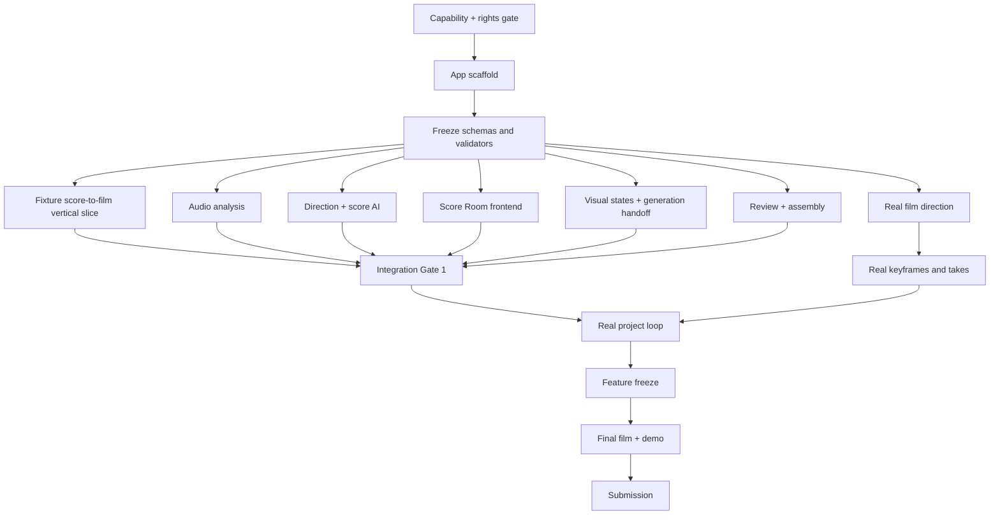

# Implementation Plan — The Director Who Does Not Exist

## 1. Purpose

This plan converts PRD v0.3 into a feasible 29-hour hackathon build.

The product is now a **score-to-cinema AI directing tool**, not a general dailies application. The build must prove one complete creative loop:

```text
selected track
  → measured analysis
  → Music Reading
  → Director Treatments
  → Audiovisual Contract
  → Visual Score
  → visual states and shots
  → generation or import
  → musical / narrative / visual review
  → minimal repair
  → final short
```

The primary submission is the tool. A 45–75 second strongly stylized electronic-music short is the proof that the tool can listen, direct, preserve a visual world, diagnose a beautiful-but-wrong take, and repair the correct layer.

## 2. Delivery Rules

1. **The Score Room is the hero feature.** A generic project dashboard or media-review page does not prove the new thesis.
2. **Fixture-first is mandatory.** The full UI and state flow must work without paid APIs before real-model integration.
3. **Music analysis is P0.** Beat, onset, energy, candidate sections, and editable timestamps cannot be deferred.
4. **Interpretation is not measurement.** Measured analysis and Gemini output use separate records, services, and UI tracks.
5. **Treatments must differ structurally.** Three color/style variations do not satisfy the requirement.
6. **Exact synchronization is editorial.** Use deterministic trim, hold, cut, and speed operations for timing failures.
7. **Keyframe-first.** Do not spend video credits before visual states and their controlling references are approved.
8. **Manual generation is a valid production path.** Automated provider integration is conditional on credentials and must not block the demo.
9. **Every video call is a final-render attempt.** The daily limit is ten; motion generation requires an approved Visual State, locked ShotSpec, reviewed complex prompt, and credible final-cut use.
10. **No new feature after T+21:00.** Remaining time protects the film, demo, and repository.
11. **English is the product language.** The planning documents may remain Chinese/English mixed, but every demo-visible product surface and canonical schema uses English.

## 3. Non-Negotiable MVP

The build is successful only if a preloaded or newly created project can complete these steps:

1. Attach a rights-cleared 45–75 second electronic track or selected range.
2. Display locally measured waveform/energy, tempo estimate, beats/onsets, candidate sections, and confidence.
3. Edit at least one section boundary without corrupting the analysis record.
4. Display a structured Music Reading separately from measured data.
5. Compare at least two materially different Director Treatments; three is the target.
6. Approve one Film Bible and one Audiovisual Contract.
7. Display a full-range Visual Score with 5–7 segments and at least two relationship modes, including `counterpoint` or `suspension`.
8. Produce 5–7 ShotSpecs, each with musical, narrative, and visual functions.
9. Attach at least three approved Visual States or keyframes.
10. Import or generate enough video takes for a complete five-shot minimum cut.
11. Review one beautiful-but-wrong take with timestamped Musical, Narrative, or Visual evidence.
12. Apply one minimal repair at the correct layer and compare the result.
13. Lock takes and assemble them against the original audio without duration drift.
14. Export a playable H.264 short and a provenance manifest.
15. Rehearse the complete story in a demo no longer than two minutes.

Automatic video generation, stem separation, a polished Direct First journey, and a full NLE are not non-negotiable.

## 4. Current Capability Baseline

`docs/STEP_0_CAPABILITY_GATE.md` records the current environment state:

- Python, Node.js, npm, FFmpeg, ffprobe, media inspection, and transcoding passed.
- The ElevenLabs-generated 120-second demo track is locally analyzed and rights-cleared by creator declaration.
- Gemini structured output, image generation, and a 10-second automated video generation passed.
- OpenAI `sora-2` and the Videos API are reachable, but the API is scheduled to shut down on 2026-09-24 and is transition-only.
- LTX-2.3 distilled on Modal is the selected open-weight route; Modal authentication and deployment remain pending.
- Manual take import remains the guaranteed offline fallback.

The local MIR and rights gates are closed. Do not reopen general provider research. Subsequent provider work is limited to the allowlist: Gemini, OpenAI, and the Modal-hosted open-weight adapter.

## 5. Technical Baseline

| Layer | Choice | Reason |
| --- | --- | --- |
| Web control plane | Next.js App Router, React, TypeScript | One local server for the creative UI, orchestration, health, and polling |
| Rendering | Server Components by default; Client Components only for interactive editors and playback | Avoid browser-to-self request waterfalls and minimize client JavaScript |
| Styling | Repository-owned CSS and a small component vocabulary | High-contrast editorial UI without a design-system dependency |
| Contracts | Versioned TypeScript records at the control plane; JSON at worker boundaries; Pydantic only inside Python workers where useful | Keep one canonical product vocabulary without coupling the web app to Python |
| Persistence | Node.js built-in SQLite | Reliable local single-user storage without a native npm dependency or second server |
| Artifacts | Immutable local project store | Stable access to audio, frames, takes, and exports |
| Local compute | Repo-root uv/Python environment | Reproducible MIR, FFmpeg/provider scripts, and no FastAPI process |
| Audio analysis | FFmpeg/ffprobe plus `librosa` invoked as a persisted local compute job | Deterministic measurement and waveform data |
| Media | FFmpeg; OpenCV only if required | Proxies, frames, mechanical QA, retiming, assembly |
| AI | Gemini | Music interpretation, Treatments, visual development, video review, repair proposals |
| Managed video | Gemini primary; OpenAI transition-only | Preserve a provider-neutral ShotSpec and avoid lifecycle lock-in |
| Open-weight video | LTX-2.3 distilled on Modal | Audio conditioning, keyframe interpolation, retake, and inspectable execution |
| Open-weight runtime | Isolated Modal Python 3.12 image, H100/H200 benchmark, pinned Volume weights | Keep CUDA/PyTorch constraints out of the local Python 3.14 app |
| Video fallback | Manual task/import | Generation must not block the differentiating workflow |
| Long tasks | SQLite-backed run states exposed through Next Route Handlers | Recoverable without Redis or a distributed queue |

The local process boundary is deliberate:

```text
Browser
  → Next.js Server Components / Route Handlers
      → SQLite + local artifact store
      → uv-run MIR and media jobs
      → Gemini / OpenAI adapters
      → Modal Python GPU worker
```

Next.js owns product state and orchestration. Python owns workloads whose mature
libraries or CUDA runtime justify it; it is not a parallel HTTP backend. Server
Components call trusted server modules directly. Route Handlers are reserved for
mutations, health checks, external boundaries, and persisted job polling.

Preferred P0 MIR implementation:

- `librosa` for beat tracking, onset envelope, RMS, spectral centroid, chroma/recurrence, and candidate segmentation;
- NumPy arrays reduced to compact JSON display data;
- editable section boundaries stored as user revisions over immutable raw analysis;
- FFmpeg extraction to mono WAV for consistent analysis input.

If the selected MIR dependency cannot install or run by T+1:00, use a precomputed analysis fixture for the demo track and retain manual section editing. Do not lose hours changing the application stack.

## 6. Core Architecture and Contracts

### 6.1 Module boundaries

1. **Music Analysis Engine** — deterministic audio measurement and analysis revisions.
2. **Direction Compiler** — Music Reading, Director Treatments, and Film Bible.
3. **Visual Score Engine** — audiovisual relationship mapping and coverage validation.
4. **Visual Development Service** — Visual States, references, and image generation/import.
5. **Prompt Compiler** — canonical ShotSpec to provider-specific task.
6. **Provider Router** — capabilities, submit/poll/download, manual task cards, and cost.
7. **Review & Repair Engine** — mechanical, musical, narrative, visual findings, and allowed repairs.
8. **Artifact Store** — immutable files, checksums, versions, and provenance.
9. **Timeline Assembler** — locked takes, editorial operations, source audio, H.264 export.

### 6.2 Contracts to freeze before UI or AI integration

Freeze versioned schemas for:

1. `Project`
2. `AudioAsset`
3. `MusicAnalysis`
4. `MusicAnalysisRevision`
5. `MusicReading`
6. `DirectorTreatment`
7. `FilmBible`
8. `AudiovisualContract`
9. `VisualScoreSegment`
10. `VisualState`
11. `ShotSpec`
12. `Artifact`
13. `Take`
14. `ReviewReport` and `Evidence`
15. `RepairPlan`
16. `Decision`
17. `ProviderCapabilities` and `ProviderRun`
18. `AssemblyRun`

Freeze enums:

```text
creation_mode:
  listen_first | direct_first

relationship_mode:
  mirror | counterpoint | suspension | motif_binding

review_dimension:
  mechanical | musical | narrative | visual | creative

failure_class:
  mechanical_fail | timing_fail | relationship_fail |
  narrative_fail | visual_drift | continuity_fail |
  capability_fail | low_confidence_human_review |
  creative_mutation_candidate | accept

decision:
  accept | editorial_repair | regenerate | split |
  use_fallback | creative_mutation | reject | human_review
```

### 6.3 Coverage validators

Implement deterministic validators before model calls:

- timestamps are within the selected audio range;
- sections and Visual Score segments are ordered and non-overlapping;
- Visual Score coverage has no gaps;
- every shot maps to a valid score segment;
- every shot defines musical, narrative, and visual functions;
- every referenced Visual State and Artifact exists;
- locked Film Bible fields cannot be patched;
- locked takes cannot be replaced;
- assembly duration matches the selected audio range within the configured tolerance.

## 7. State Models

### 7.1 Project creative state

```text
Draft
  → Audio Analyzed
  → Music Reading Ready
  → Treatment Selected
  → Direction Locked
  → Score Approved
  → In Production
  → Rough Cut
  → Final Locked
```

Reopening the audio range, Film Bible, or approved score must create a new revision and invalidate only dependent unlocked records.

### 7.2 Shot production state

```text
Draft
  → Ready
  → Generating / Waiting for Manual Generation
  → Reviewing
  → Needs Decision
  → Locked / Repairing / Split / Fallback / Removed
```

### 7.3 Visual State lifecycle

```text
Candidate → Approved → Locked
```

Only approved Visual States can be compiled into production ShotSpecs. Automation cannot edit a locked state.

## 8. Dependency Map



The contracts and fixture vertical slice are sequential. Workstreams may run in parallel only after schemas are frozen. Real-model queues must never block UI, media, or fixture development.

## 9. Mandatory Sequential Plan

### Step 0 — Score-to-cinema capability and rights gate

**Target: T+0:00 to T+1:00**

1. Reconfirm the local toolchain recorded in `docs/STEP_0_CAPABILITY_GATE.md`.
2. Test installation and execution of the selected MIR library on one short local WAV.
3. Verify extraction of duration, waveform samples, RMS, onset envelope, tempo estimate, and beat positions.
4. Select the actual public-demo track or a locked temporary replacement.
5. Record its source, rights declaration, exact selected range, and checksum.
6. Check Gemini credentials for structured text, audio understanding, image generation, and video understanding without logging values.
7. Check one automated video path only if credentials are already available; the output must be scoped as a credible final-cut candidate.
8. Confirm that manual generated takes can be imported and probed.
9. Record the provider allowlist, daily video quota, lifecycle risks, and the Modal open-weight deployment target.

**Exit criteria**

- Local analysis works, or the team explicitly selects the precomputed-analysis fallback.
- A rights-cleared track or safe temporary track is available.
- Gemini is verified or declared fixture-only for each modality.
- Video generation is one verified allowlisted provider or manual import.
- No exploratory video generation remains in the plan; stills and fixtures carry prompt iteration.

**Stop rules**

- At T+1:00 stop debugging optional providers.
- At T+1:00 stop comparing MIR frameworks; use the first working pipeline or fixture fallback.
- Do not use music with unclear public-demo rights as the final submission track.
- Never spend a video call merely to test a prompt or compare providers.

### Step 1 — Scaffold the application and artifact layout

**Target: T+0:30 to T+2:30**

1. Scaffold one root Next.js App Router application in TypeScript.
2. Add environment templates without secrets.
3. Add deterministic Node SQLite initialization and a first migration.
4. Create project artifact directories through application startup.
5. Add health and capabilities Route Handlers, while rendering the home page from direct server-module reads.
6. Add one-command local development and test commands.
7. Add a tiny rights-cleared audio fixture and short video fixtures where licensing permits.
8. Establish English naming and error-copy conventions.
9. Retain the repo-root uv environment for MIR/provider scripts and document the isolated Modal worker boundary.

**Exit criteria**

- The server-rendered control-plane page and public Route Handlers read the same validated runtime/capability modules.
- A clean local setup creates its database and artifact directories.
- No generated private asset or credential is tracked.
- `npm run check` covers web lint, Python lint, type checking, tests, and a production build.

### Step 2 — Freeze schemas, validators, and fixtures

**Target: T+2:30 to T+4:30**

**Implementation status (2026-08-01): complete.** ProjectBundle contract v1,
deterministic cross-record validators, revision/lock rules, a full English demo
fixture, and focused invalid fixtures are implemented. See
`docs/STEP_2_CONTRACTS.md`.

1. Implement the records and enums in Section 6.
2. Implement selected-range and full-score coverage validation.
3. Implement revision rules for measured analysis, Music Reading, Film Bible, and Visual Score.
4. Implement locked-state protection.
5. Create one complete English fixture project containing:
   - measured audio analysis;
   - a Music Reading;
   - three Treatments;
   - one approved Film Bible;
   - six Visual Score segments;
   - four relationship modes or at least two for the MVP path;
   - three anchor Visual States;
   - six ShotSpecs;
   - a failed take, repaired take, Creative Mutation, and complete fallback cut.
6. Add invalid fixtures for score gaps, overlaps, out-of-range events, missing functions, and locked-field mutations.

**Exit criteria**

- All valid fixtures parse.
- Invalid coverage and mutation fixtures fail with user-facing errors.
- The Next control plane and Python/Modal workers share frozen, versioned JSON field names.
- No schema change occurs after this point without updating fixtures and validators first.

### Step 3 — Build the fixture-based vertical slice

**Target: T+4:30 to T+7:00**

Build the differentiating workflow before integrating real models:

1. Open the preloaded project and play its track.
2. Display measured sections, energy, and events.
3. Display a separate Music Reading track.
4. Compare Treatments and select one.
5. Display the Film Bible and lock status.
6. Display the aligned Visual Score tracks.
7. Edit one segment relationship and revalidate coverage.
8. Open one ShotSpec and show its three functions and linked states.
9. Preview a failed take with evidence.
10. choose an Editorial Repair or constrained Regenerate action.
11. compare the repaired take, lock it, and assemble the fixture cut with source audio.
12. show a concise activity/provenance feed.

**Exit criteria**

- The full product thesis is understandable with the network disabled.
- The Visual Score, not the review page, is visually dominant.
- The fixture cut exports as playable H.264 with the intended audio.
- A judge can see that music and film direction are separate but connected.

### Step 4 — Implement core services and product workspaces

**Target: T+7:00 to T+13:00**

Work against frozen fixtures and contracts. Details are in Section 10.

Mandatory outputs by T+13:00:

1. real local MusicAnalysis or a clearly marked fixture fallback;
2. Project Start and Score Room connected to persisted state;
3. real or recorded Music Reading and Treatment outputs;
4. Visual Score validation and editing;
5. Visual State attachment;
6. provider-neutral generation tasks with a shared daily quota ledger and final-candidate confirmation gate;
7. Gemini adapter plus recorded OpenAI and Modal capability fixtures;
8. manual generation task/import;
9. mechanical media report;
10. review/repair fixture path;
11. locked-take assembly against original audio.

### Step 5 — Integration Gate 1

**Target: T+13:00 to T+15:00**

Run one real project from audio through assembled preview.

1. Ingest the chosen track and persist its analysis.
2. Generate or load a Music Reading.
3. Generate or load two to three Treatments and approve one.
4. Create and approve a valid Visual Score.
5. attach real keyframes or references to at least three states.
6. Import the verified Gemini final-cut candidate and at least one additional real take.
7. run mechanical and semantic review or its recorded equivalent.
8. record one decision and assemble a one- or two-shot preview against the track.

**Go/no-go decisions**

- If Music Reading is unreliable, reduce it to section-level structured interpretation and keep manual edits prominent.
- If image generation is unavailable, use rights-cleared prepared keyframes and retain provenance.
- If video generation is unavailable, commit to manual import and remove live-generation claims from the demo.
- If video review is unavailable, show a recorded schema-valid review and keep the real mechanical/timing path.
- If the Score Room is not legible, stop all nonessential backend work and repair the hero interaction.

### Step 6 — Direct and produce the real companion short

**Target: T+15:00 to T+21:00**

1. Lock the selected 45–75 second audio range.
2. Produce three concise Treatments; choose one and preserve an alternative for the demo.
3. Lock a Film Bible with a deliberately small visual vocabulary.
4. Approve five to seven Visual Score segments.
5. Approve at least three anchor Visual States.
6. Freeze a render call sheet before any video request: candidate ID, score range, provider, prompt file, intended cut position, and fallback.
7. Count the existing 10-second Gemini result as one candidate and verify the account-wide remaining quota before production.
8. Target a five-shot cut: spend no more than four additional primary calls, reserve up to three for failed anchors/repairs, and leave two unspent whenever the known daily budget is nine remaining.
9. Generate/import the hardest anchor transitions first.
10. Give every required shot a usable still-hold or imported fallback before improving quality.
11. Build the complete rough cut as soon as five shots can cover the score.
12. Select one genuine beautiful-but-wrong take for review/repair evidence.
13. Preserve one Creative Mutation only if it strengthens the Film Bible.
14. Replace weak takes only after a complete cut exists and only through the approved call sheet.

**Exit criteria**

- The short plays from beginning to end with no missing range.
- The same world, material, camera, and transformation grammar is legible across the cut.
- At least one audiovisual relationship is non-literal.
- All final or fallback takes have provenance and decisions.
- Demo evidence is frozen and no longer dependent on queues.

### Step 7 — Feature freeze and reliability pass

**Target: T+21:00 to T+24:00**

No new screens, providers, models, relationships, or schema fields after T+21:00.

1. Run schema, coverage, state, media, and assembly tests.
2. Verify the app boots and the preloaded project works without network access.
3. Verify measured/interpreted layers remain visibly separate.
4. Verify score edits cannot create gaps or overlaps.
5. Verify locked direction, states, and takes cannot be silently replaced.
6. Verify malformed AI output cannot mutate canonical state.
7. Verify final duration matches the audio range and audio remains present.
8. Remove or hide incomplete P1 controls.
9. Review all English UI copy, errors, model disclosures, and asset credits.
10. Produce a final demo database and read-only backup of demo assets.

### Step 8 — Final film, demo, repository, and submission

**Target: T+24:00 to T+29:00**

1. Lock and export the final film by T+25:00.
2. Rehearse the two-minute flow against the preloaded project.
3. Record the product demo and explanation by T+26:30.
4. Add English captions and ensure waveform labels, Treatments, evidence, and final film are legible.
5. Finish README, architecture, setup, model disclosure, rights/credits, known limitations, and screenshots.
6. Verify the repository from a clean setup or the cleanest reproducible local equivalent.
7. Upload before the soft deadline.
8. Reserve the final 30 minutes for verification and emergency asset replacement only.

## 10. Parallel Workstreams

Parallel work begins only after Step 2 freezes contracts.

### Track A — Music Analysis Engine

Deliver:

1. audio normalization and checksum;
2. compact waveform samples;
3. RMS/energy curve;
4. onset envelope and onset timestamps;
5. tempo estimate and beat timestamps;
6. spectral-change or novelty curve;
7. candidate sections with confidence;
8. analysis JSON caching by audio checksum and selected range;
9. editable revisions without rewriting raw measurements;
10. deterministic audio fixtures and tests.

Do not attempt a research-grade universal music-structure model. Candidate boundaries plus human correction are sufficient.

### Track B — Direction Compiler

Deliver:

1. Music Dramaturg structured prompt;
2. clear separation between measured evidence and interpretation;
3. two to three genuinely distinct Director Treatments;
4. Treatment comparison fields: proposition, narrative, visual grammar, music relationship, production risk;
5. Film Bible synthesis and invariant locking;
6. Audiovisual Contract and Visual Score proposal;
7. schema validation, time-range validation, retries, and recorded fixtures;
8. concise rationales without chain-of-thought.

If credentials are missing, recorded fixtures are the official integration path, not a hidden mock.

### Track C — Score Room and product shell

Deliver:

1. Project Start with Listen First and Direct First options;
2. audio player and synchronized playhead;
3. measured music, Music Reading, Narrative, Visual State, Relationship, and Shots tracks;
4. editable section boundaries or a constrained boundary editor;
5. relationship-mode selection with plain-language descriptions;
6. Treatment comparison and approval;
7. Film Bible and state-lock indicators;
8. shot detail drawer with three functions;
9. loading, fixture, offline, malformed-analysis, and validation-error states.

Avoid building a DAW or draggable frame-accurate NLE. A fixed-scale score with editable timestamps is acceptable.

### Track D — Visual development and generation handoff

Deliver:

1. Visual State cards at approved anchors;
2. reference upload with control labels: world, subject, material, composition, motion, or palette;
3. image generation/edit integration if credentials work;
4. start/end-state linkage on ShotSpecs;
5. provider capability endpoint;
6. canonical `GenerationTask` compiled to Gemini, OpenAI, or Modal-LTX without mutating the ShotSpec;
7. generation gate requiring approved states, locked ShotSpec, prompt-file checksum, intended cut range, quota reservation, and explicit final-candidate confirmation;
8. Gemini primary adapter; OpenAI transition adapter behind a lifecycle warning; Modal-LTX adapter contract with fixture mode until deployment credentials exist;
9. guaranteed manual task card with prompt, states, references, duration, aspect ratio, expected filename, and import target;
10. provider fixtures for unsupported input, moderation, timeout, rate limit, insufficient credits, quota exhaustion, and failure;
11. immutable render ledger recording provider, model/checkpoint, prompt checksum, references, request time, cost/quota reservation, output hash, and final-cut disposition.

Do not implement undocumented provider automation or add providers outside the allowlist.

Modal-LTX deployment slice, executed only after the fixture adapter is stable:

1. keep the worker in `modal/` with its own Python 3.12/CUDA dependency definition; do not install PyTorch or LTX weights into the local uv environment;
2. pin the LTX-2.3 distilled checkpoint, repository revision, CUDA/PyTorch versions, and community-license identifier;
3. download weights once into a named Modal Volume and load them in `@modal.enter`;
4. start with H100/H200 and benchmark one approved final candidate for peak memory, cold start, warm latency, and cost;
5. expose asynchronous submit/status/download semantics matching the canonical provider adapter;
6. store generated media in project artifact storage immediately; a provider URL is never canonical;
7. support `audio_to_video`, `keyframe_interpolation`, and `retake` as distinct capabilities rather than one untyped prompt endpoint;
8. require the same render-ledger and final-candidate gate used by managed providers.

### Track E — Review, repair, and assembly

Deliver:

1. ffprobe metadata and file validation;
2. duration, codec, dimensions, frame rate, audio presence, black/frozen frame checks;
3. exact comparison between take duration, intended shot range, and assembly operation;
4. structured review grouped by Mechanical, Musical, Narrative, Visual, and Creative dimensions;
5. timestamped evidence and adjacent-state context;
6. deterministic Editorial Repair operations: trim, hold, speed, and cut where safe;
7. constrained prompt/reference repair fixture;
8. decisions, lock protection, and retry/budget guards;
9. assembly of locked takes against the original audio;
10. H.264 output, duration validation, and provenance manifest.

Do not optimize for generic audio-motion correlation. Review the approved relationship mode.

### Track F — Companion film and demo story

Deliver:

1. selected rights-cleared track and source declaration;
2. three concise Treatments for the same track;
3. one approved Film Bible and one alternative Treatment visible in the demo;
4. five-to-seven-segment Visual Score;
5. three anchor states and complete shot list;
6. a fallback take for every required shot;
7. one beautiful-but-wrong first take and one repaired version;
8. one optional Creative Mutation;
9. complete rough and final cuts;
10. two-minute narration, captions, credits, and screenshots.

The film work may start from approved fixture contracts before the UI is ready, but all final assets must be reattached to canonical project records.

## 11. Screen and API Surface

### 11.1 MVP screens

1. **Project Start** — creation mode, audio, selected range, premise, aspect ratio, references, rights declaration.
2. **Treatments** — two or three director proposals and Film Bible approval.
3. **Score Room** — synchronized multitrack Visual Score; the hero screen.
4. **Visual States & Shots** — anchor frames, references, shot functions, generation/import status.
5. **Dailies & Repair** — player, review dimensions, evidence, versions, repair, and decisions.
6. **Final Cut** — locked coverage, assembly, export, and manifest.

These may be implemented as routes, tabs, or panels in one application shell. Do not spend time on navigation architecture beyond a clear linear workflow.

### 11.2 Backend endpoints

Keep the API surface explicit and small:

1. create/get project;
2. upload/get audio asset and selected range;
3. start/get measured music analysis;
4. create/get analysis revision;
5. generate/update/approve Music Reading;
6. generate/list/select Treatments;
7. update/lock Film Bible;
8. generate/update/approve Audiovisual Contract and Visual Score;
9. create/update/approve Visual States;
10. generate/update/order ShotSpecs;
11. list provider capabilities, quota ledger, and lifecycle warnings;
12. reserve/submit/poll/cancel/download provider or manual runs;
13. upload/get Take;
14. start/get review;
15. create/apply repair;
16. record decision and lock/unlock Take;
17. start/get AssemblyRun;
18. get activity feed and export manifest.

Endpoint details may collapse for the MVP, but domain boundaries must remain visible in service code.

## 12. Test and Integration Order

Add tests in dependency order:

1. schema parsing and enum validation;
2. timestamp bounds and score coverage;
3. locked-field and revision behavior;
4. deterministic MusicAnalysis on a tiny audio fixture;
5. analysis-cache behavior by checksum and selected range;
6. invalid measured/interpretation cross-write rejection;
7. AI structured-output validation with recorded fixtures;
8. Film Bible invariant preservation;
9. ShotSpec three-function requirement;
10. provider capability and manual-task fixtures;
11. media probe and failure fixtures;
12. Editorial Repair operations and duration math;
13. locked-take and retry/budget policy;
14. assembly against original audio with duration tolerance;
15. control-plane fixture-based end-to-end workflow;
16. real Gemini structured-text/image checks; semantic audio only with explicit asset-upload permission;
17. one reviewed final-cut-candidate generation only after its Visual State and ShotSpec are locked;
18. browser happy path on the preloaded project;
19. offline-demo and clean-setup rehearsal.

Do not snapshot exact creative prose. Assert structure, alternatives, evidence, protected fields, timestamps, coverage, allowed actions, and visible outcomes.

## 13. Integration Gates and Acceptance Checks

### Gate A — contract freeze at T+4:30

- valid full fixture project;
- invalid coverage fixtures rejected;
- relationship and decision enums frozen;
- control-plane and worker-boundary field names agreed;
- locked-state rules tested.

### Gate B — fixture vertical slice at T+7:00

- network-free listen-to-film loop;
- Score Room legible;
- Treatment choice changes downstream direction;
- repaired take locks and assembles;
- source audio survives export.

### Gate C — real-project loop at T+15:00

- real track ingested;
- analysis stored or fallback declared;
- direction and score approved;
- real keyframes attached;
- at least one real take reviewed;
- short preview assembled.

### Gate D — feature freeze at T+21:00

- complete five-shot minimum cut;
- all demo evidence local;
- at least one non-literal audiovisual relationship visible;
- before/after repair available;
- no missing rights or provenance record.

### Gate E — submission readiness at T+28:30

- final film plays independently;
- two-minute demo plays independently;
- repository setup and limitations are clear;
- no secrets or private assets are tracked;
- uploaded artifacts verified.

## 14. Recommended 29-Hour Schedule

| Relative time | Mandatory milestone | Safe parallel activity |
| --- | --- | --- |
| T+0:00–1:00 | MIR, rights, credentials, and provider gate | App skeleton |
| T+1:00–2:30 | App and storage scaffold | Lock demo-track range and artistic premise |
| T+2:30–4:30 | Schemas, validators, fixtures | Prepare initial Treatments and visual references |
| T+4:30–7:00 | Fixture score-to-film vertical slice | Workstream setup against frozen contracts |
| T+7:00–13:00 | Core service and workspace implementation | Audio, AI, UI, media, and film tracks |
| T+13:00–15:00 | Integration Gate 1 | Fix only integration blockers |
| T+15:00–18:00 | First complete real-project cut | Continue generation and review evidence |
| T+18:00–21:00 | Complete rough cut and freeze demo data | Replace only weak shots with safe fallbacks |
| T+21:00 | Feature freeze | No exceptions for optional providers |
| T+21:00–24:00 | Reliability, offline, English, rights pass | Final film finishing |
| T+24:00–25:00 | Final film export | README and demo rehearsal |
| T+25:00–26:30 | Record two-minute demo | Repository finalization |
| T+26:30–28:30 | Captions, clean-setup check, upload | Verify every deliverable |
| T+28:30–29:00 | Emergency replacement only | No development |

## 15. Contributor Allocation

### Four contributors

1. **Product/control-plane integrator** — schemas, state, persistence, Route Handlers, integration gates.
2. **Frontend/product designer** — Treatments, Score Room, Visual States, Dailies, English interaction states.
3. **AI/audio engineer** — MIR pipeline, Gemini interpretation/direction, structured outputs, fixtures.
4. **Media/film lead** — providers/manual handoff, FFmpeg, takes, assembly, companion film, final export.

All contributors join Gate C, the real-project run, and demo rehearsal.

### Two contributors

1. Contributor A: Next control plane, MIR, schemas, Gemini/fixtures, assembly.
2. Contributor B: frontend, visual direction, manual generation, film, demo.

Cut automated video generation before cutting real audio analysis or the Score Room.

### One contributor

Execute only the critical path:

1. schemas and full fixture;
2. Score Room vertical slice;
3. local audio analysis;
4. recorded Music Reading and Treatments;
5. manual keyframes and takes;
6. one real mechanical/timing review and one fixture semantic review;
7. deterministic repair and assembly;
8. film and demo.

Use five shots, two Treatments, three Visual States, and one relationship repair. Do not attempt an automated provider until the complete offline loop works.

## 16. Demo Project Assets to Prepare Early

Prepare these before T+18:00:

1. rights-cleared source track and selected-range WAV/MP3;
2. raw MusicAnalysis JSON and one user revision;
3. structured Music Reading;
4. three Treatments, or two if operating on the one-contributor scope;
5. approved Film Bible;
6. full Audiovisual Contract and Visual Score;
7. three anchor Visual States;
8. five-to-seven ShotSpecs;
9. a beautiful-but-wrong take;
10. timestamped review evidence tied to an explicit contract rule;
11. RepairPlan and repaired take/edit;
12. optional Creative Mutation;
13. complete locked rough cut;
14. final H.264 short and manifest;
15. offline provider/AI failure fixtures.

## 17. Two-Minute Demo Script Budget

| Time | Content | Proof |
| --- | --- | --- |
| 0:00–0:12 | Play the track and state the problem | This is not beat sync or a one-click MV |
| 0:12–0:30 | Show measured analysis and separate Music Reading | The system listens at multiple levels and exposes uncertainty |
| 0:30–0:48 | Compare two or three Treatments | Film direction has visual and narrative freedom |
| 0:48–1:08 | Show the approved Visual Score | Music, narrative, visual states, and relationship modes become one contract |
| 1:08–1:28 | Open one shot and its anchor states | The contract compiles into executable production tasks |
| 1:28–1:46 | Show beautiful-but-wrong take, evidence, and minimal repair | Closed-loop directing rather than blind regeneration |
| 1:46–2:00 | Play final short excerpt and provenance | The tool produces one authored audiovisual world |

Pre-record all model-dependent outputs. The live demo may edit one relationship or select one Treatment, but must not wait on generation.

## 18. Cut Order When Time Slips

Remove features in this order:

1. second video provider;
2. any live provider generation in the demo;
3. stem separation;
4. advanced automatic section labeling;
5. synchronized side-by-side playback;
6. automatic image editing; use prepared keyframes;
7. optical-flow visual-energy comparison;
8. full Direct First UI;
9. third Treatment; retain two;
10. sixth and seventh shots; retain a complete five-shot cut;
11. Creative Mutation demonstration if it obscures the primary repair story.

Do not cut:

- measured versus interpreted music separation;
- at least two distinct Treatments;
- a full-range valid Visual Score;
- one non-literal relationship mode;
- shot musical/narrative/visual functions;
- one beautiful-but-wrong review and minimal repair;
- locked-take assembly against original audio;
- preloaded offline demo.

## 19. Failure and Fallback Matrix

| Failure | Immediate fallback | Demo wording |
| --- | --- | --- |
| MIR library fails | Precomputed MusicAnalysis plus editable manual markers | Local analysis is fixture-backed in this build; the contract remains real |
| Gemini audio unavailable | Recorded structured Music Reading | Interpretation is replaceable and never overwrites measured data |
| Gemini image unavailable | Prepared rights-cleared keyframes | The product accepts external visual development assets |
| Video provider unavailable | Manual generation task cards and import | Provider-agnostic direction is a feature, not a hidden failure |
| Daily video quota is low or exhausted | Use approved still holds/imported takes; defer motion calls until the next quota window | Every request is budgeted as a final-cut candidate |
| OpenAI Videos API reaches shutdown | Disable submission while retaining old provenance and provider-neutral tasks | OpenAI was always a transition adapter |
| Modal-LTX deployment unavailable | Use Gemini plus recorded LTX capability fixtures; keep the adapter contract | Open-weight execution is isolated from the creative model |
| Gemini video review unavailable | Real mechanical/timing review plus recorded semantic evidence | The review contract remains inspectable and reproducible |
| One shot cannot be generated | Still hold, alternate take, split shot, or deterministic transition | The score retains full coverage without infinite retries |
| Score UI performance fails | Precompute reduced curves and render static SVG/canvas tracks | Preserve comprehension over frame-accurate interaction |
| Final film is visually inconsistent | Reduce to five shots and one location/material system | A smaller coherent film is better evidence than a longer montage |

## 20. Definition of Done

### Product

- The complete non-negotiable MVP works from a clean local setup or documented fixture mode.
- The interface and canonical data are English.
- The Score Room clearly separates measurement, interpretation, narrative, visual state, relationship, and shots.
- The same track has at least two distinct Treatments.
- The Visual Score covers the full selected range with valid timestamps.
- One take is reviewed and minimally repaired against an explicit contract.
- Locked records are protected.
- The final cut uses the original audio and passes duration validation.
- Visual Score and provenance manifest export successfully.

### Companion film

- The film is 45–75 seconds and complete.
- It has a recognizable world, limited material vocabulary, and controlled camera grammar.
- It includes at least one non-literal music-image relationship.
- It does not resemble a template visualizer or a collection of unrelated AI clips.
- The repaired shot belongs to the final film or is clearly linked to it in the demo.
- Music and all displayed references have recorded usage rights.

### Repository

- README explains the dual-axis product thesis and the difference from automatic MV tools.
- Setup, fixture mode, architecture, model/provider disclosure, credits, rights, and known limitations are documented.
- Secrets, private assets, temporary provider URLs, and generated caches are excluded.
- The repository states clearly which outputs are live, recorded, manual, or fixture-backed.

### Submission

- Final film and demo play from local files on a separate browser profile or machine.
- The two-minute demo shows listening, direction, score, generation task, review, repair, and final film.
- Uploads are complete and verified before the soft deadline.

## 21. Post-Hackathon Validation and Next Build

If the hackathon proof succeeds, do not immediately add providers. First:

1. interview at least three electronic musicians and three audiovisual/AI creators;
2. test whether users understand the four relationship modes;
3. measure time from track upload to approved Treatment;
4. compare a Visual Score workflow with receiving only prompts or an automatic montage;
5. identify which controls users actually edit: boundaries, narrative states, material, camera, or relationship modes;
6. decide whether the initial business is self-serve software, a studio workflow, or a tool-assisted creative service;
7. only then prioritize Direct First, stems, NLE export, live visuals, or additional providers.
