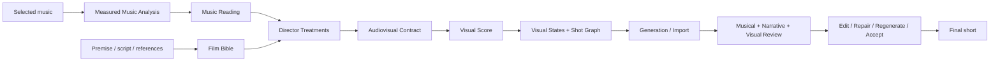

# PRD — The Director Who Does Not Exist / 不存在的导演

| Project attribute | Definition |
| --- | --- |
| Product category | Score-to-cinema AI directing tool for electronic music and auteur visual shorts |
| Core promise | Turn a selected track and an artistic premise into an editable audiovisual direction, then generate, review, and repair a coherent short film |
| Primary users | Electronic musicians, audiovisual artists, AI filmmakers, creative directors, and small visual studios |
| Companion work | A 45–75 second, dialogue-light, strongly stylized electronic-music short |
| Primary track | Tools for AI Artists; the companion film is proof of the tool's direction system |
| Product language | English for UI, schemas, logs, exports, repository, and demo; creative source input may use any language |
| Hackathon constraints | 29 hours; public GitHub repository; explanation and demo video no longer than 2 minutes |
| Document status | MVP PRD v0.3 — provider and generation-budget lock, 2026-08-01 |

## 1. Product Thesis

**The Director Who Does Not Exist** is not a beat-sync editor, a music visualizer, or a one-click music-video generator. It is an AI director that listens before it sees.

The product treats music and film direction as two sources of creative authority:

1. **Music Reading** interprets the selected track across multiple time scales: structure, phrases, recurrence, density, tension, silence, and significant sound events.
2. **Film Direction** retains meaningful freedom over premise, narrative, world, material, cinematography, transformation, montage, and visual restraint.

The two lines meet in an explicit **Audiovisual Contract**. For every section, the director chooses whether image and music mirror one another, form a counterpoint, respond after a delay, or bind a recurring sound to a visual motif. That contract becomes an editable **Visual Score**, then a Shot Graph, keyframe states, provider-specific generation tasks, and review criteria.

The system does not claim that a song contains one objectively correct film. Its value is to propose strong directorial interpretations, make their audiovisual logic visible, and preserve that logic across unstable generative-video outputs.

> **Positioning:** Give a score a director—not a visualizer.

## 2. Why This Product Exists

Electronic musicians and audiovisual creators can already access visually impressive image and video models. Their problem is not a shortage of clips. It is the absence of a coherent directing layer between a track, an artistic idea, and dozens of independently generated shots.

Current workflows fail in several recurring ways:

1. **Music is reduced to BPM.** Beat markers and energy curves are useful, but they do not express suspension, recurrence, delayed response, harmonic tension, negative space, or deliberate refusal to synchronize.
2. **Visual quality is confused with visual direction.** Each generated shot may look polished while the assembled film feels like an AI showreel with no shared world or progression.
3. **Music-to-video systems collapse interpretation into automation.** A track is treated as the sole prompt even though an authored film also requires a thesis, a world, a visual grammar, and montage decisions.
4. **General video generators work clip by clip.** They do not reason over the full score, preserve a visual motif over time, or explain why a shot belongs at a specific musical moment.
5. **Professional audiovisual tools are powerful but procedural.** Creators can build audio-reactive systems in node-based tools, but doing so demands specialist knowledge and still does not automatically produce cinematic treatments, keyframes, or generative-video tasks.
6. **Cross-shot consistency remains fragile.** References and keyframes constrain identity and style but do not guarantee continuity of material, space, scale, light, or transformation rules.
7. **Regeneration is wasteful.** When a take fails, creators often rewrite the whole prompt even if the correct action is a 250 ms editorial shift, a new end state, a calmer camera instruction, or a local reference change.
8. **Aesthetic accidents matter.** Strong stylized work often emerges from controlled discontinuity. A system that corrects every deviation destroys useful mutations; a system that accepts everything produces incoherence.

The core user problem is therefore:

> “I can generate beautiful moving images, but I cannot reliably turn my reading of this music and my film idea into one authored audiovisual form.”

## 3. Product Definition

### 3.1 Two creative axes



### 3.2 Measured and interpreted music must remain separate

The product maintains two layers so that subjective interpretation is never presented as signal-processing fact.

**Measured layer**

- duration, waveform, loudness, RMS energy;
- tempo estimate, beats, onsets, and confidence;
- spectral and timbral change;
- recurrence and candidate section boundaries;
- optional lyrics, vocals, stems, and timestamps.

**Interpreted layer**

- perceived tension, release, suspension, intimacy, weight, or instability;
- structural function such as opening, accumulation, rupture, return, or aftermath;
- which musical events deserve a visual response;
- which events should remain visually unanswered;
- alternative readings with concise evidence and confidence.

The creator can edit both section boundaries and directorial interpretation before either affects generation.

### 3.3 Film direction remains autonomous

The director is not a style picker. It proposes complete **Director Treatments** that differ in cinematic proposition, not only appearance. A treatment contains:

- logline and thematic proposition;
- narrative or non-narrative progression;
- world rules and ontology;
- subject, object, and location constraints;
- material and transformation grammar;
- color, light, composition, and camera grammar;
- montage rules, holds, transitions, and forbidden clichés;
- an explicit reading of the chosen music;
- a reason why this film belongs to this track.

The same track should be able to produce a monumental abstract treatment, an intimate chamber narrative, or a material-transformation film without implying that one is the song's “correct” meaning.

### 3.4 Audiovisual relationship modes

Each Visual Score segment uses one primary relationship mode:

| Mode | Meaning | Example |
| --- | --- | --- |
| `mirror` | Visual change follows the direction and timing of the music | Density increases as the arrangement accumulates |
| `counterpoint` | Image deliberately resists or contradicts the music | The visual world becomes still at the musical peak |
| `suspension` | Image holds across a musical change or responds later | A transformation completes four beats after the drop |
| `motif_binding` | A recurring sound is attached to one visual motif | A metallic pulse always recalls the same red aperture |

Relationship modes are directorial decisions, not automatic classifications. The MVP must use at least two modes and include at least one non-literal relationship (`counterpoint` or `suspension`).

## 4. Product Principles

1. **Listen before generating.** No video task is created before the Music Reading is visible and editable.
2. **Direction before prompts.** The canonical records are Treatment, Film Bible, Audiovisual Contract, Visual Score, and ShotSpec; provider prompts are compiled outputs.
3. **A film is not a set of pretty clips.** Every shot requires a musical function, narrative function, and visual function.
4. **Music influences film without determining it.** The director may mirror, delay, resist, or selectively ignore the score.
5. **Few visual laws beat many style adjectives.** Coherence comes from a limited world, material, camera, and transformation grammar.
6. **Keyframes are states, not decoration.** Anchor images describe how the world changes across the score.
7. **Exact timing belongs to editing.** Deterministic cutting, holding, and retiming are preferred over asking a video model to hit an exact beat.
8. **Evidence before aesthetic scoring.** Review reports cite the violated contract and observable evidence; they do not reduce taste to one opaque number.
9. **Repair the smallest broken layer.** Timing failures receive editorial fixes; visual drift receives reference or keyframe fixes; narrative failures may require regeneration.
10. **Controlled discontinuity is allowed.** A useful anomaly can be accepted as a Creative Mutation only by the human director.
11. **The human owns the cut.** Automation cannot replace a locked treatment, visual state, or take.
12. **Provider boundaries stay explicit.** Unsupported durations, reference modes, or edit capabilities fail before spending credits.

## 5. Target Users and Jobs to Be Done

### 5.1 Primary persona: electronic musician / audiovisual artist

An independent musician, label visual lead, live-visual artist, or multidisciplinary creator who has a finished track and a strong taste but no full film production team.

**Job:** “When I release or perform a piece of electronic music, help me develop a visual work that feels composed with the music—not placed on top of it.”

**Current pain:** The creator moves between waveform analysis, moodboards, image generation, video generation, and an NLE while manually preserving the same world and timing decisions.

### 5.2 Secondary persona: AI short-film director / small creative studio

A director who already has a premise, script fragment, or visual references and has selected music early in the process.

**Job:** “Help me reconcile my film idea with the score without surrendering the script or visual identity to an automatic music visualizer.”

### 5.3 Tertiary persona: creative technologist

A practitioner who wants to connect new image and video providers to a stable creative contract and compare their performance on state-to-state transitions.

### 5.4 Not the primary user

- creators optimizing daily social-post volume;
- template-based lyric-video customers;
- users who want a finished three-minute MV from one click with no review;
- editors seeking a replacement for Premiere, Resolve, or CapCut;
- VJs seeking only a real-time FFT visualizer.

### 5.5 Validation status

Competitive research supports the category, but the specific problem and workflow have not yet been validated through direct user research. After the hackathon, interview at least three electronic musicians or audiovisual creators before treating the persona and willingness-to-pay assumptions as proven.

## 6. Core User Journeys

### 6.1 Listen First

1. The creator starts a project, uploads a rights-cleared track, and chooses duration and aspect ratio.
2. The system computes measured musical features and candidate section boundaries.
3. Gemini produces an editable Music Reading with multiple interpretations and timestamp evidence.
4. The creator optionally enters one artistic premise and attaches visual references.
5. The system proposes three genuinely different Director Treatments.
6. The creator selects, combines, or edits one treatment and locks the Film Bible.
7. The system creates an Audiovisual Contract and Visual Score covering the full selected track.
8. The creator adjusts relationship modes, section timing, narrative states, and visual states.
9. The system generates or attaches keyframe states, then compiles a 5–7 shot graph.
10. Takes are generated through one provider or imported from a manual workflow.
11. Each take is reviewed against musical timing, narrative function, visual continuity, and mechanical validity.
12. The creator accepts, edits, repairs, regenerates, or keeps a Creative Mutation.
13. Locked takes are assembled against the original track and exported with a provenance manifest.

### 6.2 Direct First

1. The creator begins with a premise, script fragment, or Film Bible and visual references.
2. The creator attaches a selected track.
3. The system analyzes where the film's existing states agree or conflict with the musical structure.
4. It proposes alternative Audiovisual Contracts without rewriting protected narrative or visual invariants.
5. The remaining Visual Score, generation, review, repair, and assembly flow is identical to Listen First.

The MVP implements Listen First as the complete happy path. Direct First must be supported by the domain model and visible as an entry option, but may use a preloaded example rather than a fully separate interface.

## 7. Product Workspaces

### 7.1 Project Start

- choose `listen_first` or `direct_first`;
- attach audio, title, selected range, runtime, aspect ratio, and rights declaration;
- add an optional premise, script fragment, and references;
- display configured AI and video-provider capabilities.

### 7.2 Score Room — hero workspace

The hero screen is a synchronized multitrack timeline, not a full NLE.

```text
Measured Music   | sections, energy, onsets, significant events
Music Reading    | suspension, return, rupture, release
Narrative        | absence, discovery, awakening, loss, aftermath
Visual State     | mineral, aperture, organic intrusion, stillness
Relationship     | mirror, motif binding, suspension, counterpoint
Shots            | S01       S02       S03       S04       S05
```

Users can edit boundaries and labels, select relationship modes, and see why each shot exists. Frame-accurate trimming is out of scope.

### 7.3 Treatment & Film Bible

- compare three director proposals by proposition, music reading, narrative, visual grammar, and risk;
- combine selected elements without silently merging contradictions;
- approve world, material, color, camera, transformation, montage, and forbidden-element rules;
- lock protected invariants before image or video generation.

### 7.4 Visual Development

- show visual-state cards at structural anchors;
- attach or generate reference images and first/last-frame pairs;
- compare variations before spending on motion;
- propagate approved world references to relevant shots;
- record which part of the Film Bible each asset controls.

### 7.5 Dailies & Repair

- preview takes with selected music range;
- display mechanical facts and evidence markers;
- separate Musical Alignment, Narrative Function, and Visual Continuity findings;
- compare versions and their prompts, references, costs, and decisions;
- apply deterministic edits or constrained generation patches;
- accept, reject, repair, or accept as Creative Mutation.

### 7.6 Final Cut

- display locked shots in Visual Score order;
- warn about missing coverage, gaps, overlap, or audio-duration mismatch;
- assemble the short against the original audio;
- export H.264 preview, Visual Score JSON, and provenance manifest.

## 8. Core Domain Model

### 8.1 Creative records

1. **Project** — title, creation mode, selected audio range, runtime, aspect ratio, budget, active treatment, and active cut.
2. **AudioAsset** — original file, checksum, duration, format, selected range, source, and rights declaration.
3. **MusicAnalysis** — immutable measured features, candidate sections, events, method, confidence, and schema version.
4. **MusicAnalysisRevision** — user-corrected section boundaries and event decisions layered over the immutable raw analysis.
5. **MusicReading** — editable interpretation of structure, recurrence, tension, significant events, and intentional non-events.
6. **DirectorTreatment** — proposition, narrative path, visual world, music interpretation, directorial risks, and rationale.
7. **FilmBible** — approved theme, world ontology, subjects, objects, materials, palette, light, camera, transformation rules, montage rules, invariants, and forbidden elements.
8. **AudiovisualContract** — the approved principles governing how music, narrative, and visual change relate.
9. **VisualScoreSegment** — start/end, music evidence, narrative state, visual state, relationship mode, transition strategy, and confidence.
10. **VisualState** — a keyframe-state specification with world state, subject state, composition, material, light, camera, and reference assets.
11. **ShotSpec** — time range, musical function, narrative function, visual function, start/end states, camera, action, transition, references, provider strategy, and acceptance criteria.

### 8.2 Production records

1. **Artifact** — immutable audio, image, video, contact sheet, proxy, or export with checksum and provenance.
2. **Take** — media artifact, source, provider, prompt version, reference versions, generation settings, cost, and lock state.
3. **ReviewReport** — mechanical findings plus criterion-level Musical, Narrative, and Visual findings with timestamps, evidence, and confidence.
4. **RepairPlan** — selected layer, proposed edit or patch, preserved fields, expected effect, evidence, and estimated cost.
5. **Decision** — Accept, Editorial Repair, Regenerate, Split, Use Fallback, Creative Mutation, Reject, or Human Review with reason and actor.
6. **ProviderCapabilities** — actual supported inputs, durations, references, first/last frames, editing, extension, resolution, audio, and costs.
7. **ProviderRun** — provider job, model version, state, timing, cost, failure class, and downloaded artifacts.
8. **AssemblyRun** — selected locked takes, audio asset, timeline operations, output artifact, and validation report.

### 8.3 Invariants

- The selected audio range is immutable after Visual Score approval unless the score is explicitly reopened.
- Visual Score segments are ordered, non-overlapping, and cover the entire selected range.
- Every ShotSpec maps to at least one score segment and defines all three functions: musical, narrative, and visual.
- Provider prompts cannot modify locked Film Bible invariants.
- Only locked takes enter final assembly.
- Automation cannot replace locked Visual States, ShotSpecs, or Takes.
- Subjective model output never overwrites measured music data.

## 9. User Stories

1. As an electronic musician, I want to upload my track and see its measurable structure so that I can correct the system before it directs anything.
2. I want measured audio facts separated from AI interpretation so that speculation is not presented as truth.
3. I want the director to propose multiple readings of the same track so that the first obvious emotional interpretation does not become the film.
4. I want to start from either music or an existing film premise so that the tool fits both commissioning and directing workflows.
5. I want Director Treatments to differ in narrative and cinematic logic, not only visual style.
6. I want to approve a small set of world and transformation laws so that shots feel authored rather than generically similar.
7. I want to choose whether each section mirrors, resists, delays, or selectively binds to the music.
8. I want every shot to explain its musical, narrative, and visual function so that beautiful but empty shots can be removed.
9. I want to approve visual states before motion generation so that expensive takes begin from a coherent visual world.
10. I want reference assets labelled by what they control so that style, subject, material, composition, and motion are not conflated.
11. I want provider-specific prompts compiled from canonical direction so that changing models does not erase the film's logic.
12. I want exact cuts, holds, and small timing corrections handled deterministically so that I do not regenerate for editorial problems.
13. I want a take reviewed against the score segment and adjacent visual states so that continuity is evaluated across the cut.
14. I want aesthetic findings separated from mechanical failures so that taste remains a human decision.
15. I want the smallest repair that addresses the failed layer so that successful visual qualities remain intact.
16. I want to preserve a useful deviation as Creative Mutation so that the system does not sterilize generative work.
17. I want retry and cost limits so that an agent cannot spend indefinitely on a subjective criterion.
18. I want to lock direction, keyframes, and takes so that later automation cannot silently rewrite approved work.
19. I want the final short assembled against the original track with no drift so that the Visual Score remains true in export.
20. I want a manifest of music analysis, direction, prompts, assets, providers, reviews, edits, and decisions so that the process is reproducible.
21. As a judge, I want to see two different film treatments for one track so that visual freedom is immediately legible.
22. As a judge, I want to see one beautiful but wrong take diagnosed and minimally repaired so that the agentic value is visible.

## 10. Functional Scope and Priority

### 10.1 P0 — required for the hackathon demo

| Capability | Requirement |
| --- | --- |
| Project and audio setup | Upload one rights-cleared track, choose a 45–75 second range, set aspect ratio, premise, and references |
| Measured music analysis | Produce waveform data, energy, tempo estimate, beats/onsets, candidate sections, events, and confidence; allow edits |
| Music Reading | Generate a structured, timestamped interpretation while preserving measured/interpreted separation |
| Director Treatments | Produce at least two distinct propositions, with three as the target; approve one Film Bible |
| Audiovisual Contract | Assign relationship modes and directorial rationale across the selected range |
| Score Room | Display aligned music, narrative, visual-state, relationship, and shot tracks |
| Visual Score | Cover the full range with 5–7 editable segments and at least two relationship modes |
| Visual development | Generate or attach at least three approved anchor states and bind them to shots |
| Shot Graph | Produce 5–7 ShotSpecs with musical, narrative, and visual functions |
| Generation handoff | Support one automated provider if verified plus a guaranteed manual task-card/import path |
| Take review | Run mechanical checks and structured Musical, Narrative, and Visual review with timestamp evidence |
| Repair | Demonstrate one layer-specific repair: deterministic retiming/cut or constrained keyframe/prompt patch |
| Human decisions | Accept, reject, repair, lock, or accept as Creative Mutation |
| Assembly | Assemble locked takes against the original track with verified audiovisual duration |
| Audit and demo | Export Visual Score, provenance manifest, and a preloaded two-minute demo project |

### 10.2 P1 — only after P0 is stable

1. Automatic downbeat and phrase estimation beyond basic beat/onset analysis.
2. Stem separation and stem-specific visual bindings.
3. Direct First as a fully polished journey rather than a shared-domain entry path.
4. First/last-frame generation and video-extension strategies across multiple providers.
5. Optical-flow visual-energy comparison with the score.
6. OpenTimelineIO or NLE marker export.
7. Side-by-side synchronized take playback.
8. Second independent critic for high-cost or low-confidence decisions.
9. Reusable visual grammars and director treatments.

### 10.3 P2 — post-hackathon

1. Full-track projects longer than 90 seconds.
2. Interactive live-visual or MIDI/OSC output.
3. Learned creator preference and recurring visual-world memory.
4. Multi-user comments, label/client approvals, and cloud project sharing.
5. Provider marketplace and production render queue.
6. Advanced compositing, masks, depth, and motion-control integration.
7. Album- or performance-level visual identity across multiple tracks.

## 11. MVP Success Criteria

The MVP succeeds only if all of the following are true:

1. A real 45–75 second rights-cleared electronic track enters the product and produces an editable measured analysis.
2. Measured values and Gemini's Music Reading are visibly separated.
3. The project contains at least two materially different Director Treatments for the same track; three is the target.
4. The approved Visual Score covers the full range with no gaps or overlaps and uses at least one `counterpoint` or `suspension` segment.
5. Five to seven ShotSpecs each state their musical, narrative, and visual functions.
6. At least three anchor Visual States are approved before motion generation.
7. At least five shots have a locked take or explicit fallback, allowing a complete short to assemble.
8. One take is visually impressive but fails an explicit audiovisual or visual rule; the report cites timestamped evidence.
9. One repair changes only the failed layer and produces a visibly better second take or edit.
10. One human decision can preserve a Creative Mutation without weakening locked invariants elsewhere.
11. The exported film stays synchronized with the selected audio range and passes codec, duration, black-frame, freeze, and audio-presence checks.
12. Every final shot is traceable to its score segment, visual states, references, prompt, provider, cost, review, and human decision.
13. The two-minute demo makes the chain legible: **listen → interpret → direct → score → generate → review → repair → film**.

## 12. Review and Repair Model

### 12.1 Review dimensions

1. **Mechanical validity** — file, codec, duration, frame rate, resolution, black/frozen frames, and audio presence.
2. **Musical alignment** — whether the take performs the approved relationship mode and transition at the intended time.
3. **Narrative function** — whether the shot changes or communicates the story state defined by the treatment.
4. **Visual continuity** — whether material, palette, light, scale, camera, subjects, and transformation obey the Film Bible and adjacent states.
5. **Creative value** — a human-facing observation about unexpected but expressive results; never an automatic failure.

### 12.2 Failure classes

- `mechanical_fail`
- `timing_fail`
- `relationship_fail`
- `narrative_fail`
- `visual_drift`
- `continuity_fail`
- `capability_fail`
- `low_confidence_human_review`
- `creative_mutation_candidate`
- `accept`

### 12.3 Repair policy

Repair the smallest failed layer in this order:

1. Correct metadata, provider parameters, or reference mapping.
2. Apply deterministic trim, hold, cut, speed, or transition timing within approved limits.
3. Replace or edit the end state, start state, or shot-specific reference.
4. Patch only the failed camera, action, material, or transformation instruction.
5. Split a complex transition into shorter shots.
6. Use first/last-frame, video-to-video, extension, compositing, or masking if supported.
7. Change provider.
8. Ask the human to change the Visual Score, accept a Creative Mutation, or remove the shot.

The system never treats higher correlation between motion and audio as universally better. A `counterpoint` or `suspension` segment can correctly have low instantaneous synchronization.

## 13. Agentic and Deterministic Responsibilities

| Role | Responsibility | Implementation boundary |
| --- | --- | --- |
| Music Analyzer | Extract measured signals and candidate boundaries | Deterministic local code; no aesthetic claims |
| Music Dramaturg | Propose editable interpretations with timestamp evidence | Gemini structured output |
| Film Director | Propose Treatments synthesizing music and premise | Gemini structured output; human chooses |
| Visual System Designer | Define world, material, camera, transformation, and montage grammar | Gemini multimodal plus references |
| Score Composer | Build Audiovisual Contract and Visual Score | Gemini proposal plus deterministic coverage validation |
| Prompt Compiler | Translate canonical ShotSpec into provider tasks | Gemini constrained by provider capabilities |
| Production Coordinator | Submit, poll, ingest, version, and enforce budgets | Deterministic orchestration |
| Review Engine | Combine media checks, score comparison, video understanding, and continuity evidence | Local media analysis plus Gemini |
| Repair Planner | Select an allowed layer-specific repair | Gemini recommendation constrained by deterministic policy |
| Human Director | Approve interpretation, direction, mutations, and final cut | Final authority |

No agent may expose or store chain-of-thought. Store only structured decisions, concise rationales, evidence, and user-visible alternatives.

## 14. Model and Technical Strategy

### 14.1 Audio analysis

- Normalize and inspect audio with FFmpeg/ffprobe.
- Use local music-information-retrieval tools for beat, onset, RMS energy, spectral change, chroma/recurrence, and candidate sections.
- Prefer a small, tested `librosa` pipeline for P0; make section markers editable because tempo-halving, rubato, ambient passages, and complex rhythm can fail.
- Use Gemini audio understanding for timestamped semantic interpretation, not sample-accurate beat detection.
- Stem separation is P1 and must not block the main score.

### 14.2 Visual development and video generation

- Generate or curate still visual states before motion.
- Favor a small number of recurring materials, spaces, objects, and camera rules over long style prompts.
- Use image-to-video and first/last-frame control when the selected provider supports them.
- Treat providers as replaceable execution engines; never store their prompt as the creative source of truth.
- Abstract or dialogue-light imagery is preferred for the demo to reduce lip-sync and character-identity risk while making material continuity central.
- The provider allowlist is Gemini, OpenAI, and an open-weight worker deployed on Modal. No other video provider is in MVP scope.
- Gemini is the primary managed path. OpenAI is transition-only because its Videos API and Sora 2 models are scheduled to shut down on 2026-09-24.
- LTX-2.3 distilled is the initial Modal candidate because its published pipelines include audio-to-video, keyframe interpolation, and localized retake; its community license must be reviewed before commercial use.
- Uploaded audio references are not supported by Gemini Omni Flash. Music therefore becomes a measured and interpreted Visual Score first; generated visuals are assembled against the untouched source track afterward.
- Video generation is a scarce final-render action. Every call requires an approved Visual State, a locked ShotSpec, reviewed complex prompt, intended musical range, and a realistic chance of entering the final cut.
- The current account budget is at most ten video generations per day. Discovery, prompt debugging, and cosmetic variants use still images or fixtures instead of video calls.

### 14.3 Video understanding limitations

- Mechanical checks and precise timing are local and deterministic.
- Gemini reviews the original video and selected audio context against structured criteria.
- Dense frames or contact sheets supplement moments that default video sampling might miss.
- Subjective findings require evidence and remain overridable.
- The generation model and primary critic should differ where practical.

## 15. Architecture

Use a local-first, single-user architecture optimized for a reliable live demo.

| Layer | Choice |
| --- | --- |
| Web control plane | Next.js App Router, React, TypeScript, Server Components, Route Handlers |
| Local persistence | Node.js built-in SQLite, accessed only from server modules |
| Local analysis | Repo-root uv/Python environment for `librosa`, provider probes, and FFmpeg orchestration |
| Open-weight worker | Isolated Python 3.12/CUDA service on Modal; no local GPU dependency |
| Contracts | Versioned TypeScript control-plane contracts plus JSON worker boundaries; Pydantic stays worker-local where useful |
| Artifacts | Local immutable project store |
| Audio/video | FFmpeg, ffprobe, local MIR library; OpenCV only if required |
| AI | Gemini for audio interpretation, direction, visual development, and review |
| Managed video | Gemini primary; OpenAI transition adapter until 2026-09-24 |
| Open-weight video | LTX-2.3 distilled in an isolated Python 3.12/CUDA Modal worker |
| Model storage | Revision-pinned weights in Modal Volume; local app stores only task/provenance records |
| Video fallback | Manual generation/import remains supported |
| Long tasks | Persisted provider/worker run state with Route Handler polling |

The Next.js application is the only local web server. Server Components read trusted
local modules directly; the browser does not call the application's own Route
Handlers merely to render a page. Route Handlers exist for mutations, polling,
health checks, and future external/worker boundaries. Python is not a second web
backend: it is a compute runtime for MIR jobs, provider tooling, and the Modal GPU
worker. This keeps the hackathon control plane compact without forcing
audio/CUDA workloads into JavaScript.

Deep modules:

1. **Music Analysis Engine**
2. **Direction Compiler**
3. **Visual Score Engine**
4. **Visual State & Prompt Compiler**
5. **Provider Capability Router**
6. **Review & Repair Engine**
7. **Artifact & Provenance Store**
8. **Timeline Assembler**

Each module must work against fixtures when network credentials are missing.

## 16. Companion Film Brief

### 16.1 Format

- 45–75 seconds;
- electronic, cinematic, restrained, progressively structured music;
- dialogue-light or wordless;
- five to seven shots;
- strongly stylized rather than photoreal-by-default;
- 16:9 master, with other ratios out of scope;
- music and all references must be rights-cleared for public demo use.

### 16.2 Working proposition

An impossible city learns to breathe by incorrectly remembering its previous state. Each recurrence in the music returns the world with one rule changed. The final transformation is not a climax of movement but a sudden, irreversible stillness.

This is a candidate Treatment, not a hard-coded product output. The product must visibly produce at least one alternative interpretation of the same track.

### 16.3 Candidate visual grammar

- no conventional protagonist is required;
- recurring aperture, mineral plane, and almost-human scale as motifs;
- matte mineral, oxidized metal, translucent organic membrane;
- restrained cold-neutral palette with one limited accent color;
- only three camera behaviors: observe, approach, and drift;
- transformations alter weight, scale, topology, or memory rather than adding generic particles;
- avoid neon cyberpunk cities, DJs, waveform imagery, arbitrary space imagery, and a cut on every beat;
- preserve one controlled generative mutation if it strengthens the film's laws.

### 16.4 Originality boundary

Superpoze and MANARËM are references for musical qualities such as spatial restraint, progressive electronic structure, recurrence, and tension—not targets for imitation. The film must not copy a living artist's identifiable musical or visual style, and the public demo should use an original or explicitly licensed track.

## 17. Competitive Positioning

1. **Automatic music-video products** publicly offer track analysis, storyboards, character consistency, and full-video generation. They validate demand but make “song to storyboard” insufficient as a differentiator.
2. **Audio-reactive visual tools** provide deep parameter control and live responsiveness but require procedural construction and do not inherently create cinematic Treatments or generative-video tasks.
3. **General AI filmmaking platforms** provide strong storyboarding, references, and shot generation but are not organized around an editable full-track audiovisual contract.
4. **The Director Who Does Not Exist** differentiates through the dual authority of music and film direction, explicit relationship modes, state-based visual development, and a closed review/repair loop across providers.

The product competes on directorial coherence and inspectability, not generation speed or number of style presets.

## 18. Product Validation Plan

After the hackathon, test the product with 5–8 participants: at least three electronic musicians and three audiovisual/AI filmmakers where possible.

Tasks:

1. Upload a 45–60 second track and correct the proposed structure.
2. Compare three Treatments and explain their differences without facilitator help.
3. Modify one audiovisual relationship from mirror to suspension or counterpoint.
4. Identify why one ShotSpec exists in musical, narrative, and visual terms.
5. Review a failed take and select an appropriate repair.

Initial success targets:

- 80% complete the Listen First happy path without critical assistance;
- median time from upload to approved Treatment under 10 minutes;
- at least 70% correctly distinguish measured analysis from interpretation;
- at least 70% can explain the chosen relationship mode for a segment;
- at least 60% of proposed score boundaries are retained or adjusted rather than discarded;
- creators rate the Visual Score as more useful than receiving only prompts or an automatic first cut;
- all critical usability issues receive severity and evidence before further feature expansion.

These are validation targets, not current evidence.

## 19. Risks and Mitigations

| Risk | Mitigation |
| --- | --- |
| Output looks like disconnected AI clips | Lock a small visual grammar and anchor states before motion; reject beautiful shots with no function |
| Music analysis becomes a beat visualizer | Separate macro, meso, and micro structure; require a non-literal relationship mode |
| AI invents one “correct” emotional reading | Offer alternatives, show evidence and confidence, preserve human edits |
| Film direction ignores the music | Every score segment and shot cites musical evidence and an explicit relationship |
| Music overdetermines visual content | Maintain Film Bible autonomy and compare distinct Treatments for the same track |
| Cross-shot consistency fails | Use recurring world references, state pairs, limited materials/camera, adjacent-shot review, and abstraction-friendly content |
| Exact sync is unreliable in generation | Solve timing with deterministic editing and only regenerate when the visual event itself is wrong |
| Visual quality depends on model luck | Keyframe-first workflow, variant comparison, locked references, retry limits, and a complete fallback cut |
| Ten-call daily video budget is exhausted | Treat every call as a final-cut candidate; require prompt-file review and quota ledger; prototype with stills and fixtures |
| OpenAI video backend disappears | Keep it transition-only and compile all work from provider-neutral ShotSpecs |
| Modal cold start or weight load is too slow | Pin weights in a Modal Volume, load once per container, use asynchronous jobs, and retain Gemini/manual fallbacks |
| Open-weight license is incompatible with launch | Record the exact checkpoint and license; complete legal review before commercial deployment |
| 29 hours is insufficient | Limit the film to 45–75 seconds, five to seven shots, one complete workflow, one provider or manual import |
| Credentials or provider queues fail | Fixture-first app, preloaded demo project, manual generation/import, locally assembled final film |
| Copyright or style imitation risk | Use rights-cleared music/assets and describe formal qualities rather than named-artist imitation prompts |
| Aesthetic judgment is presented as objective | Separate mechanical facts, contract compliance, and human taste |

## 20. Out of Scope

1. TikTok/Reels optimization, trend templates, viral scoring, or social publishing.
2. Automatic lyric videos, avatar performance, or multilingual lip-sync.
3. A full NLE, DAW, compositing package, or node-based VJ environment.
4. Real-time concert rendering, MIDI, OSC, or live FFT control in the MVP.
5. One-click generation of a polished full-length three-to-six-minute music video.
6. Training a new foundation image, video, audio, or multimodal model.
7. Guaranteeing objective emotional interpretation or “high-end” aesthetic quality.
8. Guaranteeing perfect cross-shot character or world consistency.
9. Browser automation or reverse engineering of undocumented provider interfaces.
10. Mimicking a living musician, director, visual artist, or studio's identifiable style.
11. Using music, footage, characters, or references without a recorded rights declaration.

## 21. External Facts Informing the PRD

1. Gemini audio understanding supports description, timestamped analysis, transcription, and emotion detection, but model interpretation still requires post-processing and human evaluation: [Gemini audio understanding](https://ai.google.dev/gemini-api/docs/audio).
2. Local MIR tools can extract beat positions, tempo, rhythm, tonal, spectral, and high-level descriptors: [Essentia music extractor](https://essentia.upf.edu/streaming_extractor_music.html) and [librosa beat tracking](https://librosa.org/doc/latest/generated/librosa.beat.beat_track.html).
3. Veo supports first- and last-frame-conditioned generation for short clips, making state-to-state video generation technically viable: [Veo first and last frames](https://docs.cloud.google.com/vertex-ai/generative-ai/docs/video/generate-videos-from-first-and-last-frames).
4. Commercial products already claim song-structure analysis, narrative/storyboard generation, audio reactivity, and character consistency, confirming that those features alone are not unique: [Neural Frames](https://www.neuralframes.com/product), [Freebeat Storyboard](https://freebeat.ai/hi/ai-music-video-storyboard), and [Atlabs Music Video](https://www.atlabs.ai/music-video).
5. Professional audio-reactive tools expose direct parameter control from audio analysis, illustrating the control expected by serious audiovisual creators: [Notch audio workflow](https://manual.notch.one/1.0/en/docs/learning/working-with-audio/) and [Resolume audio analysis](https://www.resolume.com/support/parameter-animation).
6. Research with professional creators found transitions and holds to be an expressive way to create coherent visual narratives in music visualization: [Generative Disco](https://arxiv.org/abs/2304.08551).
7. Gemini Omni Flash provides video generation and conversational editing, but currently does not accept uploaded audio references; time-coded direction must therefore be compiled outside the video call: [Gemini Omni Flash](https://ai.google.dev/gemini-api/docs/omni).
8. OpenAI will remove the Videos API and Sora 2 model family on 2026-09-24 without a published replacement, so it cannot be the long-term backbone: [OpenAI deprecations](https://developers.openai.com/api/docs/deprecations#2026-03-24-sora-2-video-generation-models-and-videos-api).
9. The official LTX-2 repository exposes audio-to-video, keyframe interpolation, and retake pipelines; Modal supplies GPU functions, persistent Volumes, and container lifecycle hooks suitable for hosting it: [LTX-2](https://github.com/Lightricks/LTX-2), [Modal GPUs](https://modal.com/docs/guide/gpu), and [Modal model weights](https://modal.com/docs/guide/model-weights).

## 22. Assumptions and Open Questions

### Assumptions

1. The hackathon submission is the tool; the short is its strongest proof.
2. The demo can use a 45–75 second excerpt rather than a full song.
3. The ElevenLabs-generated electronic demo track is rights-cleared by creator declaration.
4. Gemini is the verified managed path, but every AI step still requires a recorded fixture path for offline rehearsal.
5. Open-weight inference runs on Modal rather than the local development machine.
6. Manual generation/import remains an acceptable formal workflow if a remote provider is unavailable.
7. The initial user prefers a high-agency creative tool over one-click automation.

### Open questions to validate

1. Do target creators prefer starting from a track, a premise, or both at once?
2. Are four relationship modes expressive enough without becoming technical jargon?
3. How much of the Music Reading should be editable before the UI becomes a DAW?
4. Do creators value three Treatments, or would two deeper alternatives be better?
5. Which visual constraints are most useful across providers: materials, camera, composition, transformation, or negative prompts?
6. Is the strongest initial market a self-serve creator tool, a studio workflow, or a tool-assisted creative service?
